# Diagrama de navegación del sistema (vista usuario)

Este documento describe el flujo de navegación principal del sistema para un usuario autenticado o no autenticado. Incluye un diagrama Mermaid visual, la lista de rutas principales con sus restricciones de rol/permiso y notas de implementación (archivos donde están definidas las rutas).

---

## Diagrama (Mermaid)

```mermaid
flowchart TD
  subgraph Publico
    Login["Login\n('/')"]
  end

  subgraph App[Dashboard]
    DB["Dashboard\n('/dashboard')"]
    Inicio["Inicio\n(index)"]
    Empresas["Empresas\n('/dashboard/gestion-empresas/empresas')\nperm: gestionar_empresas\nroles: Administrador"]
    Rubros["Rubros\n('/dashboard/gestion-empresas/rubros')\nperm: gestionar_rubros\nroles: Administrador"]
    DefRatios["Definición Ratios\n('/dashboard/gestion-empresas/definicion-ratios')\nperm: gestionar_ratios_definicion\nroles: Administrador"]
    Usuarios["Usuarios\n('/dashboard/usuarios')\nperm: manage_users\nroles: Administrador"]
    Catalogo["Catálogo de Cuentas\n('/dashboard/catalogo-cuentas')\nperm: gestionar_catalogo_cuentas\nroles: Administrador, Analista Financiero"]
    Estados["Estados Financieros\n('/dashboard/estados-financieros')\nroles: Administrador, Analista Financiero"]
    Analisis["Análisis Balance\n('/dashboard/analisis-balance')\nroles: Administrador, Analista Financiero, Analista, Admin"]
    Ventas["Proyección de Ventas\n('/dashboard/gestion-empresas/ventas-mensuales')\nperm: ver_proyecciones\nroles: Administrador, Analista Financiero"]
    BenchmarkProm["Benchmark promedio\n('/dashboard/benchmark-promedio')\nroles: Administrador\nperm: ver_ratios"]
    BenchmarkRubro["Benchmark por Rubro\n('/dashboard/benchmark-rubro')\nroles: Administrador, Analista Financiero"]
    AsignacionCatalogo["Asignación Catálogo\n('/dashboard/gestion-empresas/asignacion-catalogo')\nroles: Administrador, Analista Financiero"]
    Help["Ayuda\n('/dashboard/help')"]
  end

  Login --> DB
  DB --> Inicio
  DB --> Empresas
  DB --> Rubros
  DB --> DefRatios
  DB --> Usuarios
  DB --> Catalogo
  DB --> Estados
  DB --> Analisis
  DB --> Ventas
  DB --> BenchmarkProm
  DB --> BenchmarkRubro
  DB --> AsignacionCatalogo
  DB --> Help

  %% Rutas especiales de analista apuntando a su empresa
  AnalistaRole["Analista Financiero\n(autoredirect)"]
  AnalistaRole -->|si tiene empresa_id| CalculoRatios["Cálculo de Ratios\n('/dashboard/empresas/:empresaId/ratios')"]
  AnalistaRole --> ComparacionInterna["Comparación Interna\n('/dashboard/empresas/:empresaId/ratios/comparaciones')"]
  DB --> AnalistaRole

  classDef restricted fill:#fee2e2,stroke:#fca5a5;
  class Usuarios,Empresas,Rubros,DefRatios,Catalogo,Estados,Analisis,Ventas,BenchmarkProm restricted;
```

---

## Lista de rutas principales (extracto desde `src/App.jsx`)

- / (Login)
  - Componente: `src/pages/auth/LoginScreen.jsx`
  - Acceso: público. Si ya está autenticado redirige a `/dashboard`.

- /dashboard (Dashboard)
  - Componente wrapper: `src/components/ui/Dashboard/Dashboard.jsx`
  - Subrutas (ejemplos):
    - /dashboard (index)
      - `src/pages/dashboard/Inicio.jsx` — accesible para usuarios autenticados.
    - /dashboard/gestion-empresas/empresas
      - Componente: `src/pages/GestionEmpresas/Empresas/EmpresaPage.jsx` (import en `App.jsx` como EmpresaPage)
      - Requiere permiso `gestionar_empresas`.
      - Rol típico: `Administrador`.
    - /dashboard/gestion-empresas/rubros
      - Componente: `src/pages/GestionEmpresas/Rubros/RubroPage.jsx`
      - Requiere permiso `gestionar_rubros`.
    - /dashboard/gestion-empresas/definicion-ratios
      - Componente: `src/pages/GestionEmpresas/Ratios/RatiosPage.jsx`
      - Requiere permiso `gestionar_ratios_definicion`.
    - /dashboard/usuarios
      - Componente: `src/pages/GestionUsuarios/UsersPage.jsx`
      - Requiere permiso `manage_users`.
    - /dashboard/catalogo-cuentas
      - Componente: `src/pages/GestionCuentas/Catalogo.jsx`
      - Requiere permiso `gestionar_catalogo_cuentas`.
    - /dashboard/estados-financieros
      - Componente: `src/pages/EstadosFinancieros/EstadosFinancieros.jsx` y varias rutas anidadas para crear/importar/editar.
      - Roles: `Administrador`, `Analista Financiero`.
    - /dashboard/analisis-balance
      - Componente: `src/pages/AnalisisVerticalHorizontal/AnalisisBalance.jsx`.
      - Roles: `Administrador`, `Admin`, `Analista`, `Analista Financiero`.
    - /dashboard/analisis-balance/graficos
      - Componente: `src/pages/AnalisisVerticalHorizontal/DashboardGraficos.jsx`.
    - /dashboard/gestion-empresas/ventas-mensuales
      - Componente: `src/pages/GestionEmpresas/Ventas/YearList.jsx` y `YearDetail.jsx`.
      - Requiere permiso `ver_proyecciones`.
    - /dashboard/gestion-empresas/asignacion-catalogo
      - Componente: `src/components/CatalogoCuentas/AsignacionCatalogo.jsx`
      - Roles: `Administrador`, `Analista Financiero`.

- Rutas de protección implementadas en `src/App.jsx`:
  - `PrivateRoute` — verifica token en `localStorage`.
  - `RoleRoute` — comprueba `user.roles` (vía `authService.getCurrentUser()`).
  - `PermissionRoute` — comprueba `authService.getPermissions()`.

---

## Resumen de acceso (reglas rápidas)

- Usuario no autenticado
  - Solo puede ver `/` (login). Si intenta acceder a `/dashboard` se redirige al login.

- Usuario autenticado
  - Acceso básico: `/dashboard` y `/dashboard/help`, `/dashboard/reports` (según componente).
  - Acceso a secciones administrativas/avanzadas dependiendo de `roles` y `permissions`:
    - Roles comunes: `Administrador`, `Admin`, `Contador`, `Analista`, `Analista Financiero`, `Inversor`.
    - Permisos ejemplo: `gestionar_empresas`, `gestionar_rubros`, `gestionar_ratios_definicion`, `manage_users`, `gestionar_catalogo_cuentas`, `ver_proyecciones`, `ver_ratios`.

---

## Dónde están las rutas en el código

- `src/App.jsx` — definición principal de rutas, wrappers de protección y lista completa de subrutas.
- `src/components/ui/Dashboard/Dashboard.jsx` — barra lateral, menú y generación automática de breadcrumbs. Aquí se define el `menuItems` con labels, hrefs y control por roles/permissions.

---

## Cómo ver el diagrama

- En GitHub: GitHub renderiza bloques Mermaid en la vista del README/MD (si la plataforma lo permite). Si no se ve, instala una extensión de VS Code para renderizar Mermaid o usa la vista previa de Markdown de VS Code con la extensión "Markdown Preview Enhanced".

- En VS Code: abrir el archivo `docs/diagrama-navegacion-usuario.md` y usar "Open Preview" (Ctrl+K V) o la paleta de comandos "Markdown: Open Preview to the Side".

---

## Notas y siguientes pasos sugeridos

- Puedo generar una versión visual más detallada (Mermaid con subgrupos por permisos, o Diagrama SVG) si lo deseas.
- Puedo añadir un archivo adicional `docs/tabla-rutas.md` que liste cada ruta con el componente exacto (path file) si quieres documentación para desarrolladores.

---

Archivo generado a partir del estado actual del proyecto (rutas encontradas en `src/App.jsx` y menú en `src/components/ui/Dashboard/Dashboard.jsx`).
